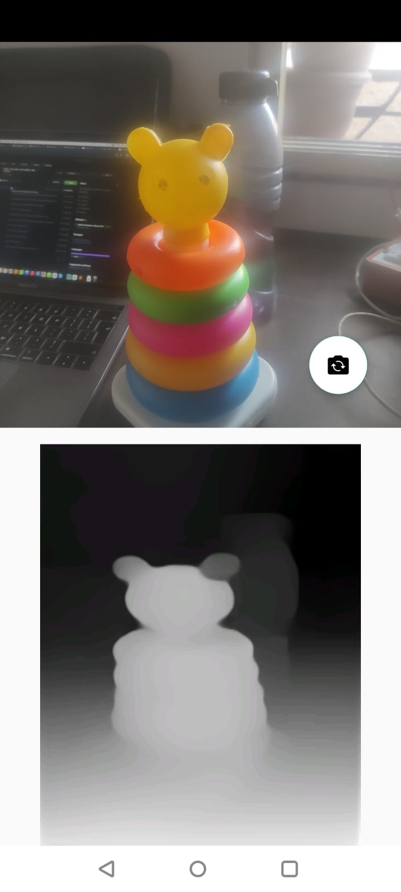

<div align="center">
  <h1>Akeso : Depth Estimation SDK In Android With MiDaS</h1>
</div>



The repository contains an Android Library project which uses the [MiDaS](https://github.com/isl-org/MiDaS) model to perform monocular
depth estimation. You can find the official Android example here -> https://github.com/isl-org/MiDaS/tree/master/mobile/android

This Library project uses the TFLite model from the [MiDaS's TensorFlow Hub repo](https://tfhub.dev/intel/midas/v2_1_small/1).
The following steps can helps to integrate this library with your own sample project. You can input your image to this library which use
model to process it and give you a Image Bitmap back.

Download
--------
**Use AAR:**

You can directly include the aar file into your sample app from below release link.
*Steps :*
1. Keep the aar file into your project's libs folder.
2. Add dependcies of AAR ffile into your module/app level build.gradle file and sync the project.
   
````gradle
implementation files('libs/midas_depth_sdk-0.0.1.aar')
````

You can download a aar from GitHub's [releases version 0.0.1](https://jitpack.io/com/github/asfaksyd/midas_depth_sdk/0.0.1midas_depth_sdk-0.0.1.aar).

**Or use Gradle:**

Please add jitpack repository of your project root build.gradle file first.

```gradle
dependencyResolutionManagement {
    repositoriesMode.set(RepositoriesMode.FAIL_ON_PROJECT_REPOS)
    repositories {
        mavenCentral()
        maven { url 'https://jitpack.io' }
    }
}
```
Now, you can add below dependecy to your module or all level build.gradle file.
````gradle
dependencies {
    implementation 'com.github.asfaksyd:midas_depth_sdk:0.0.1'
}
````

**Or Maven:**

```xml
<!-- First add jitpack.io repository url in yor app -->
<repositories>
    <repository>
        <id>jitpack.io</id>
        <url>https://jitpack.io</url>
    </repository>
</repositories>

<!-- Add below dependecy to your maven project -->
<dependency>
    <groupId>com.github.asfaksyd</groupId>
    <artifactId>midas_depth_sdk</artifactId>
    <version>0.0.1</version>
</dependency>
```

How to use this SDK ?
-------------------

After adding depeendecies into your project successfully, first step will be iniializing the library model class [MiDASDepthModel](https://github.com/asfaksyd/midas_depth_sdk/blob/master/midas_depth_sdk/src/main/java/com/akeso/depthsdk/MiDASDepthModel.kt)

You can initialize the library into any where from Activity/Fragment onCreate()/onPause()/onStart() or oCreateView()/onViewCreated() etc... depends oo your usage.

Please see below how we deed for activity

```kotlin

 private var depthEstimationModel : MiDASDepthModel? = null

 override fun onCreate(savedInstanceState: Bundle?) {
  ...
  depthEstimationModel = MiDASDepthModel(this)
}
````
After successfully initalize the library you can use the same object of that class to start running the model.

NOTE : To run this model you need to make sure just two things
1. Run this model in some background thread, suggest to use Kotlin [Coroutine](https://kotlinlang.org/docs/coroutines-overview.html) or Java [ExecuterService](https://docs.oracle.com/javase/7/docs/api/java/util/concurrent/ExecutorService.html) 
2. Pass your image into argument of the function calledd getDepthMap()

````kotlin
CoroutineScope(Dispatchers.IO).launch {
    depthEstimationModel?.getDepthMap(inputImage)
}
````

And last do not forget to close your model when stop using, agai you can do that mostly in onPause()/onStop()/onDestoryView()/onDestroy() based on where you started and when you want to stop running the model.
````kotlin
override fun onDestroy() {
    super.onDestroy()
    depthEstimationModel?.stopModel()
}
````

Build Instructions (Optional)
-------------------
**Instrction is useful while interating library or depenencies with your app**

follow this comand to build your project after adding this or any other library into your sample app project.

````commandline
./gradlew clean
./gradlew build
````

Compatibility
-------------

 * **Minimum Android SDK**: requires a minimum API level of 23 (Android 6.0 - Marshmallow).
 * **Compile Android SDK**: requires you to compile against API 34 or later (Android 14.0 - UpsideDownCake).

Author
------
Asfak Saiyed - @asfaksyd on GitHub

License
-------
BSD, part MIT and Apache 2.0. See the [LICENSE](https://github.com/asfaksyd/DepthEstimationSample/blob/main/LICENSE) file for details.
